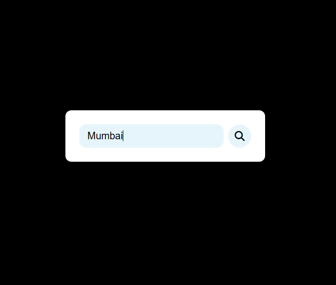
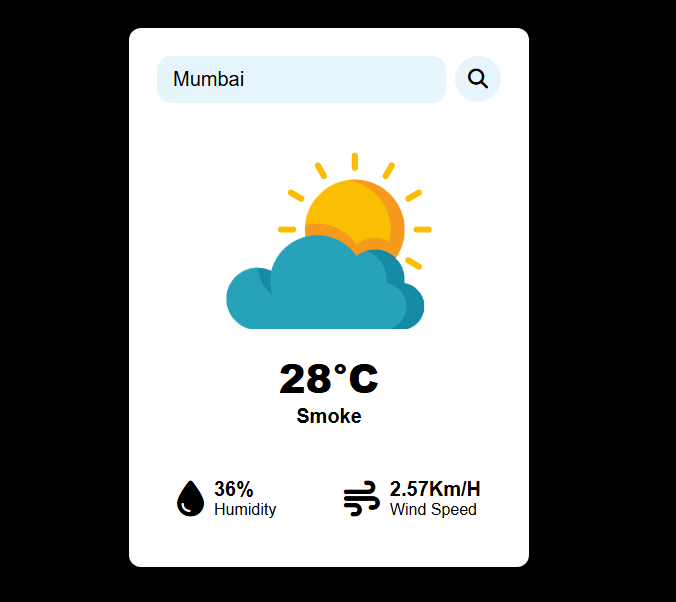

# 🌦️ Weather App

A simple and responsive Weather App that provides real-time weather updates based on city search. It fetches live weather data using the OpenWeather API and displays key weather information such as temperature, humidity, and wind speed.

## 📌 Features
✅ Search weather by city name  
✅ Displays temperature, humidity, wind speed  
✅ Dynamic weather icons based on conditions  
✅ Responsive design for mobile and desktop  
✅ Error handling for invalid city names  

## 🛠️ Tech Stack
- **Frontend**: HTML, CSS, JavaScript  
- **API**: OpenWeather API  
- **Other Tools**: Fetch API  

🌍 API Usage
This app uses the OpenWeather API to fetch real-time weather data.
To use it with your own API key:
Sign up on OpenWeather and get an API key.
Replace "YOUR_API_KEY" in the JavaScript file with your actual API key.

🖼️ Screenshots
### Home Page  

### Weather Search Example  

